# Go Programming Advanced

## Goroutines

- Goroutines are lightweight threads managed by the Go runtime. They enable concurrent execution of functions, allowing you to perform multiple tasks concurrently within a single Go program.

- Goroutines are one of the key features of GO making it easy to write concurrent and parallel programs. We use Go routines to efficiently handle parallel tasks such as input output operations, calculations and more.

- Goroutines provide us a way to perform taks concurrently without manually managing threads. To create a new goroutine, we use `go` keyword preceding the function and execute that function immediately in the main function.

- Why use Goroutine:
    - Simplify concurrent Programming
    - Efficiently handle parallel tasks such as i/o operations, calculations and more.
    - Provide a way to perform tasks concurrently without manually managing the threads.

- Basics of Goroutines:
    - Creating Goroutines (use the `go` keyword to start a new Goroutine)
    - Goroutine Lifecycle
    - Goroutine Scheduling

- Goroutines are just functions that leave the main thread and run in the background and come background and come back to join the main thread once the functions are finished/ready to return any value.

- Goroutines do not stop the program flow and are non-blocking in nature. Similary to async await and promises in Javascript. Goruntime handles the goroutines. It immediately extracts the function preceding with `go` keyword out of the main thread.

- Goroutine Life cycle: 
    - A goroutine starts when created and runs concurrently with other goroutines. 
    - A goroutine exits when the function it is running completes. So goroutine contains a function and if the function completes, then it exits.

    - It's the GoRuntime that manages goroutine scheduling and execution.

- What is Goroutine Scheduling ?
    - Goroutine scheduling is managed by the Goruntime scheduler. It uses M:N scheduling model. M goroutines run on N os threads.
    - Another thing that the goroutine scheduling does is that it efficiently multiplexex goroutines onto available threads.

- Go uses M:N scheduling model where, M goroutines are mapped onto N operating system threads. Your processor have cores and threads and your goroutines are mapped onto those limited number of cores and threads. This model allows goruntime to manage many Go routines with fewer operating system threads, improving efficiency and scalability. The goroutine scheduler efficiently multiplexex Go routine onto available threads.

- Multiplexing is like switching. Goroutine scheduler multiplexes or switches goroutines onto available OS threads. The scheduler is switching goroutines onto the available operating system threads. It means, it can run many goroutines on a limited number of threads by dynamically scheduling and rescheduling goroutines as needed. And this efficient use of resources ensures high concurrency and performance.

- Goroutine Scheduling in Go :
    - Managed by the Go runtime scheduler
    - Uses M:N scheduling model
    - Efficient Multiplexing

- Common pitfalls and best practices
    - Avoiding Goroutine leaks
    - Limiting Goroutine creation
    - Proper error handling
    - Synchronization


- Goroutine execution is concurrent in nature. And Goroutines run independently and concurrently.

- Concurrency vs Parallelism overview :
    
    - Concurrency means multiple tasks progress simultaneously and not necessarily at the same time. But parallelism states that tasks are executed literally at the same time on multiple processors. So goroutines facilitate concurrency and the goruntime scehdules them accross available CPUs for parallelism when possible.

    - So goroutines are a tools that Go has provided us to make use of concurrency in Go programs and Goruntime schedules thos go routines accross the available CPU threads, CPU cores for parallelism if it is possible.

- Associated topics:
    - Wait groups
    - Worker pools
    - Channels

- Handling Errors in Goroutine through a concept called error propagation. So goroutines execute functions concurrently and in that case errors need to be communicated back to the main thread, so use return values or shared error variables if not using channels. So if we are not using channels we can use shared error variable.


## Channels - Introductions

- Channels and Goroutines go hand in hand.
- Channels are a ways for goroutines to communicate with each other and synchronize their execution. They provide a means to send and receive values between Goroutines, facilitating data exchange and coordination.

- We use channels to enable safe and efficient communication between concurrent goroutines. Using channels hels synchronize and manage the flow of data in concurrent programs.

- Why use channels ?
    - Enable safea and efficient communication between concurrent Goroutines.
    - Help synchronize and manage the flow of data in concurrent programs.

- Basics of Channels
    - Creaing channels : `make(chan Type)`
    - Sending and Receiving Data `<-`
    - Channels Directions
        - Send-only: `ch <- value`
        - Receive-only: `value := <- ch`

- Common Pitfalls and Best Practices
    - Avoid Deadlocks
    - Avoiding Unnecessary Buffering
    - Channel Direction
    - Graceful Shutdown
    - Use `defer` for unlocking

- Concept:
    ```go
    // variable = make(chan Type)
	greeting := make(chan string)
	greetString := "Hello Go"

	greeting <- greetString

	receiver := <- greeting
	fmt.Println(receiver)
    ```

    - Issue with this code is that it tries to send a value to a channel without having a Goroutine ready. A goroutine should be there to receive from that channel and without a goroutine to receive from the channel, it cause deadlock because channels in Go are blocking. 

    - Goroutines are non-blocking. They are extracted away from the main thread, the main execution thread of our application where the main function is running and will continue to run seamlessly in a non-blocking way if we have goroutine.

    - If we have a function here, then that function , if it is not declared with a Go keyword, it will block the execution of the rest of the statements after that function until the time that function is complete. But if we use a go keyword that function is extracted out of main thread, and then the next statements will continue to run before that function is even processed.

    - Similarly, like a function that blocks the execution flow of our main function, a channel will also block the execution of our main function of our main thread.

    - So that's why we need to receive values into a channel inside a goroutine so that it doesn't block the main execution thread. 

    - Correct Code:
        ```go
        // variable = make(chan Type)
        greeting := make(chan string)
        greetString := "Hello Go"
        go func(){
            greeting <- greetString
        }()
        receiver := <- greeting
        fmt.Println(receiver)
        ```

    - Here `receiver` is receiving outside of the goroutine in the main funciton, so why is it not blocking the execution ? 
        - Because `receiver` is part of the main goroutine. The main execution thread is a goroutine because it is running continuosly and it is the main funcition of our application.
        - So receiver is also a part of a go routine and that's how this channel is communicating the goroutine and the main goroutine. So receiver is not just an independent receiver, it is a receiver inside another go routine. And that makes the `greeting` communicate between two go routines.

    - Receiving from a channel is also blocking and if there is no value to receive, then it will wait for a value to be received and next line will not be executed until the time it receives a value.


## Unbuffered Channels and Runtime Mechanism

- By default when we make a channel with the above syntax, it is an unbuffered channel.

- Buffered channel means a channel with storage. A buffer is a storage. So a channel with associated storage. Channel buffering allows channels to hold a limited number of values before blocking the sender.Buffered channels are useful for managing data flow and controlling concurrency.

- Why should we use buffered channels over unbuffered channels ?
    - Buffered channels allow asynchronous communication, which means that buffered channels allow senders to continue working without blocking until the buffer is full. Buffer channels will only block when the buffer is full.

    - Buffer channels also help us in load balancing, handling bursts of data without immediate synchronization and hence buffer channels also allow for a better flow control, meaning that we can manage the rate of data transfer between the producers and consumers.

- Unbuffered channels always needs an immediate receiver and that is why we cannot use a send inside the main function. We cannot send data into an unbuffered channel inside the main function because as soon as we do that, it will immediately look for a receiver and it will not find the receiver. The receiver will be in next line, however the unbuffered channels require an immediate receiver as soon as they are receiving a value inside them. They need someone to receive those values into. They need a variable to which they can pass their value to.

- 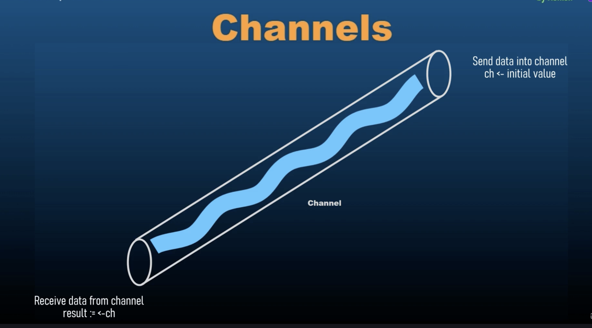

- As soon as we receive the value inside a channel, it will try to find a channel that is going to emit this value to another variable. The main thread works faster than the goroutine because goroutine takes time to get out of the main thread and then it goes on to the next line. As soon as a channel receives a value, it needs to pass that value to a receiving end, it cannot hold those values.

- Channels and goroutines, they go hand in hand.

- Receiver will wait for all the goroutine to finish and then it ill throw an error.   

- Unbuffered channels block on receive if there is no corresponding send operation ready and as soon as there is a send operation ready, then it doesn't block. Then it receives the value from that send operation and uses that value as per our instructions.

- Another property of unbuffered channels is that, unbuffered channels block on send if there is no corresponding receive operation ready but if there is a goroutine, they wait for the goroutine to finish.

- The basic property of channel is to wait for a goroutine to finish and as soon as it receives its value then it will let the execution flow to move on to the next line. Until then it will keep the execution at halt and it won't let it move forward.

- The default behavior for channels is that they allow for goroutines to finish, even if those go routines are not relevant to those channels.


## Buffered Channels

-  Buffered channels allow channels to hold a limited number of values before blocking the sender. Buffered channels are useful for managing data flow and controlling concurrency. 

- So buffer essentially means storage. We are allowing channels to store values. In unbuffered channels, channels cannot store values. They need an immediate outflow of the value that they receive. As soon as they have an incoming value, they need a receiver a receive the value because they cannot hold a value. However, buffered channels can hold values inside them. They do not require an immediate receiver. Due to this buffered our main function is not blocked and hence buffered channels offer us an asynchronous communication. 

- Buffered channels allow senders to continue working without blocking until the buffer is full and they do not require an immediate receiver. They will only block when the buffer is full and they will only blocj when we are trying to insert more value, when we are trying to send more value inside the channel when it is already full. So the channel will not return an error or will not block as soon as it gets full. It will only block or return an error when we try to send more value.

- Other than that, we also use buffered channels when we are handling burst of data without immediate synchronization. Immediate synchronization means that we are receiving values and sending values to a receiver immediately. But we don't need immediate synchronization because we are storing values inside a buffer.

- If the buffer is empty we cannot receive data. So if we try to receive when the buffer is empty, then it should block our code instead of giving an error.

- While sending data to a channel, it will implement a blocking mechanism when the buffer is full. That's for sending data into a buffered channel. 

- And when we are receiving data into a buffered channel, we will encounter a blocking mechanism when the buffer is empty, when we are trying to receive values from a buffer which is empty.

- Other than these two, buffer channels have non-blocking operations. They allow non-blocking sends and receives as long as the buffer is not full or empty.

- Impact on Performance :
    - Buffered channels can improve performance by reducing synchronization overhead and when it comes to unbuffered channels, they typically use strict synchronization where sender and receiver must be synchronized, they must be ready at the same time to send and receive values.

- We should chose buffer size based on the expected volumes of data and concurrency requirements and that is because large buffers reduce the likelihood of blocking but increase memory usage, and smaller buffers increase the likelihood of blocking, but use less memory. 

- Why use buffered channels ?
    - Asynchronous Communication
    - Load Balancing
    - Flow Control

- Creating Buffered Channels:
    - `make(chan Type, capacity)`
    - Buffer capacity

- Key Concepts of Channel Buffering
    - Blocking Behaviour
    - Non-Blocking Operations
    - Impact on Performance

- Best Practices for using Buffered Channels
    - Avoid over-buffering
    - Graceful shutdown
    - Monitoring buffer usage


## Channel Synchronization

- Why is Channel Synchronization important ?
    - Ensures that data is properly exchanges between Goroutines.
    - Coordinates the execution flow to avoid race conditions and ensure predictable behavior.
    - Helps manage the lifecycle of Goroutines and the completion of tasks.

- Common pitfalls and best practices
    - Avoid Deadlocks
    - Avoid unnecessary blocking
    - Close channels

- Channel synchronization refers to the coordination of go routines using channels to ensure orderly execution and data exchange. 

- Channels help synchronize goroutines by providing a mechanism to block and unblock goroutines based on the channel's state.

- Channel synchronization is important because this is going to be used in real world scenarios. These are the concepts that will be used in a chat application or a real-time stock market application or a news channel application where news feed comes in through a stream and it needs to be regularly and differe news to be shown continuously to the users .

- If we have a channel and it is continuously sending data, we can loop over that channel and that will create receiver and it will keep on receiving the value. So here's a new concept that we can range over the channel.

- Channel Synchronization aims to provide a thorough understanding of how channels can be used to coordinate and manage concurrent execution in Go programs.


## Advanced: Quiz-1

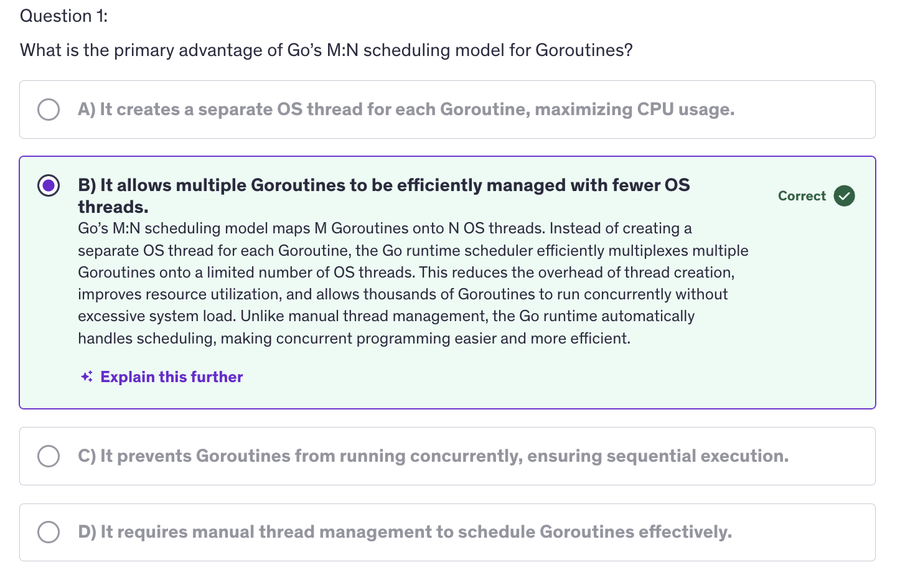
<br/>


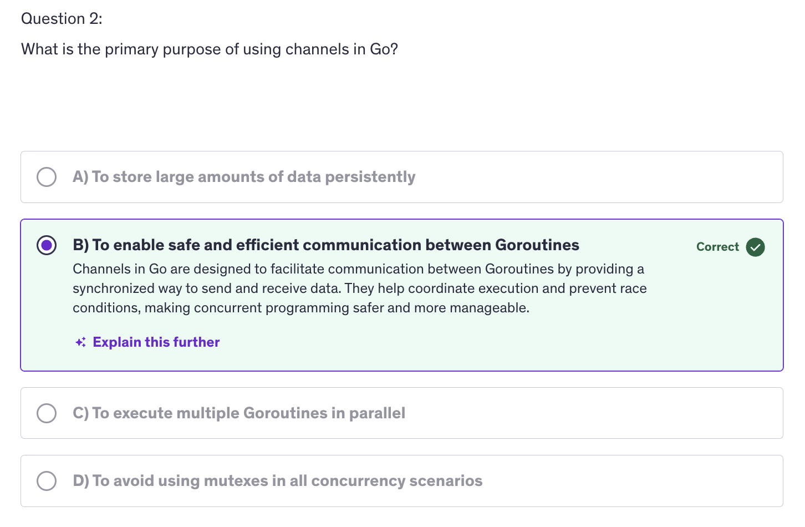
<br/>


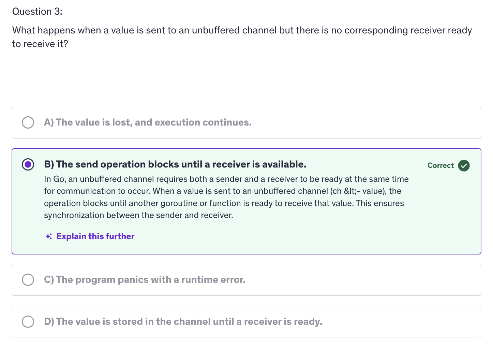
<br/>


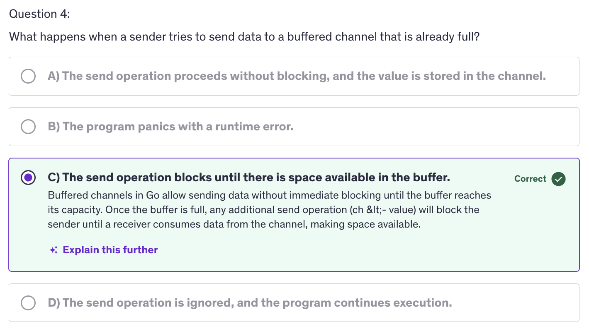
<br/>


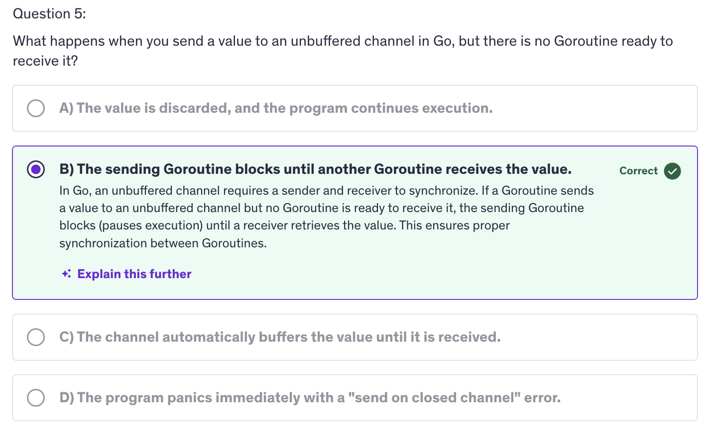
<br/>


## Channel Directions

- Channel directions specify the allowable operations on a channel, either sending or receiving. They are used to enfore and document the intended use of channels in functions and goroutines.

NOTE: Channel directions are intended for use in functions and goroutines, not as an independent variables that we declare.

- Why are channel directions important ?
    - Improve code clarity and maintainability
    - Prevent unintended operations on channels
    - Enhance type safety by clearly defining the channel's purpose.

- Basic Concepts of Channel Directions :
    - Unidirectional Channels
    - Send-Only channels
    - Receive-Only channels
    - Testing and Debugging

- Defining Channel Directions in Function Signatures
    - Send Only Parameters `func produceData(ch chan <- int)`
    - Receiving Only Parameters `func consumeData(ch <- chan int)`
    - Bidirectional Channels `func bidirectional(ch chan int)`

- Send-Only channel means that we can send value into the channel. Receive-Only channel means a channel from which we can only receive data.

- Unidirectional channels are used in function signatures to specify whether a function can send or receive data. This helps to avoid misuse and clarify the role of each functino in a concurrent program.

- And during channel creation, make channel with type creates a bidirectional channel. The unidirectional channels make sense when they are only declared in function signatures, but they don't make any sense when created directly with make function.

- By using unidirectional channels in function signatures, you can design your concurrent code to be more robust and explicit about how channels are used.


## Multiplexing using Select

- Multiplexing is the process of handling multiple channel operations simultaneously, allowing a go routine to wait on multiple channel operations and react to whenever operation is ready first.

- The select statement in Go facilitates multiplexing by allowing a goroutine to wait on multiple channel. Multiplexing is like a switch. So `select` statement that we have used before.

- Multiplexing manages multiple concurrent operations within a single goroutine and it manages those concurrent operations seamlessly with improved readability.

- Multiplexing efficiently handles operations that might block without looking up resources so it handles the blocking operations pretty efficiently.

- More importantly we get to implement timeouts and cancellation mechanism. We can cancel channels using multiplexing. So the basic syntax of `select` is very simple: `select case default`. `Select-case` is only for handling channels to be precise for handling multiple channel operations simultaneously.

- We can use select with `timeouts` and it makes our job easier to implement cancellation of channels. We use `time.After()` function to implement timeouts, providing us a way to handle operations that take too long.

- When we are done sending the values to the channel, we should close the channel. It's a good practice to close the channel we are using oonce we are done with the channels. If you are continuously receiving a stream of data, then don't close it, then defer the close until the time the channel gets closed from the source or close it when we shut down our application.

- When the channel is closed, the select statement will receive the zero value from that channel, zero value of the string, int or zero value of a struct, whatever types that channel is.

- The select statement in Go is used for implementing multiplexed communication with channels. It allows you to wait on multiple channel operations simultaneously and perform a corresponding action when one of them becomes ready. Some key use cases and features of the `select` statement are multiplexing channel operations, which means that the primary use of Select is to wait for multiple channel operations to become ready and then execute the corresponding case block. This enables concurrent handling of multiple communication channels without needing separate goroutines for each channel.

- Another feature of the select statement is non-blocking communication. The `select` statement enables non-blocking communication with channels. If none of the channel operations are ready, select does not block the execution of the program, this allows you to perform other tasks or take alternative actions if all channel operations are blocked. And we use a `default` case for that.

- By using `select`, we can prevent potential deadlocks that may occur when sending or receiving from channels. For example we can combine, channel sends and receives with timeouts or default cases to handle scenarios where communication may block indefinitely.

- Next important feature is synchronization and coordination. `Select` can be used for synchronization and coordinatino between Goroutines by coordinating multiple Goroutines through shared channels and using `select` to wait for specific events, you can design concurrent programs with precise control over their execution flow.

- Why use Multiplexing :
    - Concurrency
    - Non-Blocking
    - Timeouts and Cancellations

- Best Practices for using `select`:
    - Avoiding busy waiting
    - Handling deadlocks
    - Readability and maintainability
    - Testing and debugging


## Non-Blocking channel operations

- Why use Non-Blocking Operations:
    - Avoid Deadlocks
    - Improve Efficiency
    - Enhance Concurrency

- Best practices for Non-Blocking operations
    - Avoid Busy waiting
    - Handle channel closure properly
    - Combine with contexts for cancellations
    - Ensure channel capacity management

- Non-Blocking operations on channels allow a goroutine to perform a channel operation like send or receive without getting stuck, if the channel is not ready. They help maintain responsiveness and prevent goroutines from getting blocked indefinitely.

- Why do we need to use non-blocking operations ?
    - To avoid deadlocks, prevent goroutines from waiting indefinitely on channel operations and a
    - To improve efficiency i.e allow goroutines to continue processing or handle other tasks if channels are not immediately ready.
    - Most importantly, to enhance concurrency. Manage multiple concurrent operations more effectively by not blocking on individual channel operations.

- The select statement with a default case allows for non-blocking receives by immediately executing the default case if no other channels are ready.

- We use non-blocking operations to handle real-time data processing where timely responses are critical.

- Another non-blocking operation is handling channel closures. Channels do send out an `ok` a boolean value to let us know if the channel is open or closed.


## Closing Channels

- Why close channels ?
    - Signal Completion 
    - Prevent Resource Leaks

- Best Practices for Closing channels:
    - Close channels only from the sender
    - avoid closing channels more than once
    - avoid closing channels from multiple goroutines

- Common patterns for closing channels
    - Pipeline pattern
    - Worker Pool pattern

- Debugging and Troubleshooting Channel Closures
    - Identify Closing channels errors
    - USe `sync.WaitGroup` for coordination

- Signal Completion: : It indicates that no more data will be sent on the channel, which helps goroutines that are receiving data know when to stop waiting.

- Prevents Resource Leaks: Closing channels ensures that resources assosciated with the channel are properly cleaned up. 

- For closing a channel we use the close function and after a channel is closed, no more values can be sent to it. However, we can receive values from a closed channel if it is a buffered channel. A buffered channel may have some values stored in it, and those values can be received even if the channel is closed because closing a channel means that the channel is closed for sending data into the channel, not for receiving values from a channel. We can always receive values from a channel if it has some values, if it is not empty.

- Basic Principles / Guidelines rules :
    - Close channels only from the sender. Do not close channel from the receiving end. Only the goroutine that is sending data should close the channel. Other goroutines that are receiving should only read from the channel.

    - Sometimes we close a channel more than once and that results in a runtime panic. So always ensure that channels are closed exactly once.

    - Similarly, we need to ensure to that only one goroutine is responsible for closing the channel to avoid race conditions and panics. We should not close a channel twice and we should not close channels from multiple goroutines because one goroutine might be sending data to the channel while the other goroutine closes the channel and if the channel is closed in between, and then the other goroutine is still trying to send data into the channel then that will again cause an error.

- There are certain patterns for closing the channels like :
    - Pipeline Pattern: Channels are used to pass data through a series of stages which are pipelines. Each stage closes the channel when it is done processing, so we are going to have a producer and a filter and these functions, which are producer and filter are going to close the channels respectively which they should.

    - Worker Pool Pattern: dicussed in later lectures

- SO now we need to know that whether it's a buffered channel or an unbuffered channel, every channel needs to be closed manually by us and a channel is closed by using the close function, and once a channel we cannot send any more values to that channel. And once a channel is closed, it sends out a value, a boolean value to the receiver and we can receive that value and check if the channel is open or closed and if the channel is closed, we can handle the closing channel gracefully in our program.


## Advanced: Quiz-2

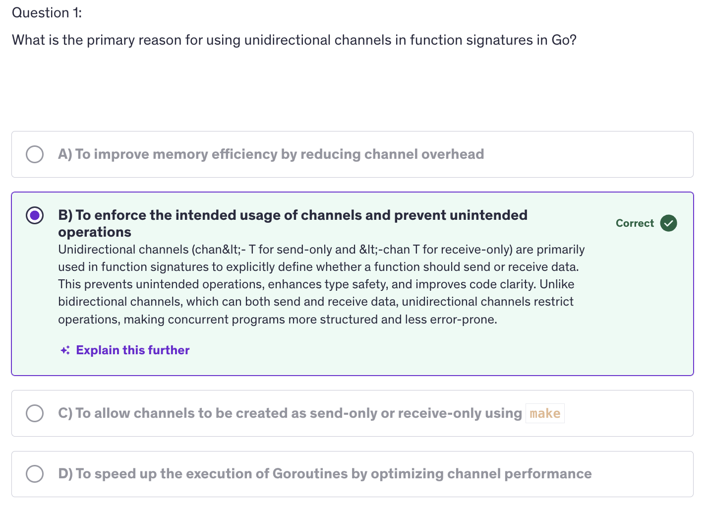
<br/>

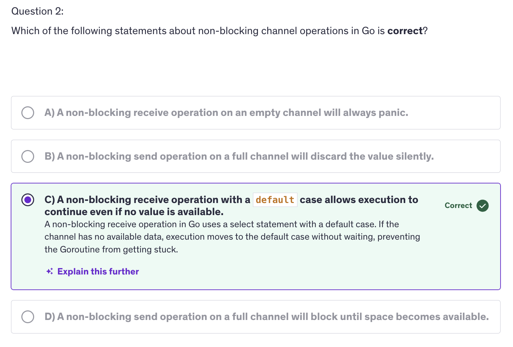
<br/>

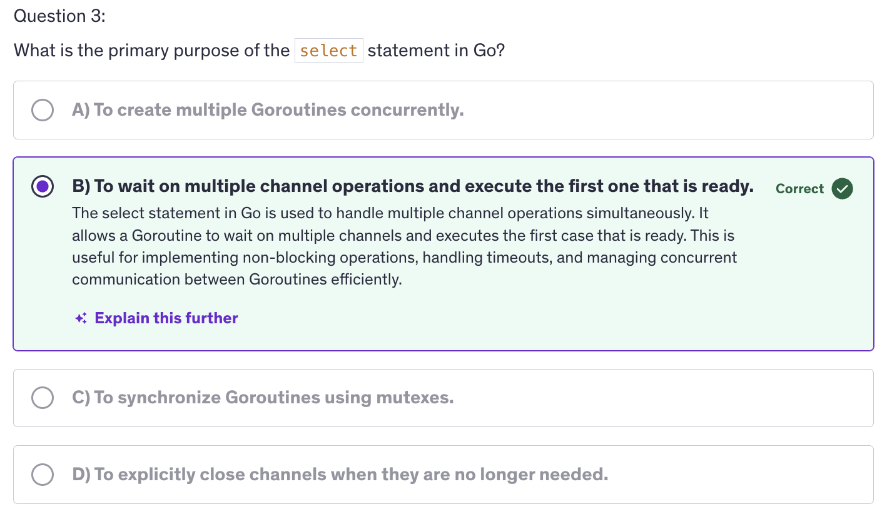
<br/>

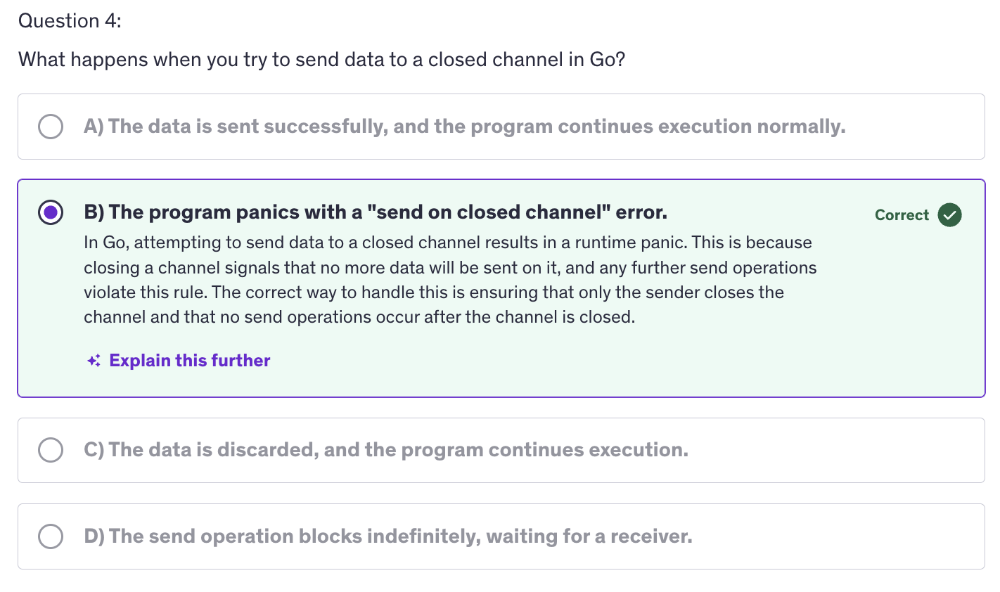
<br/>

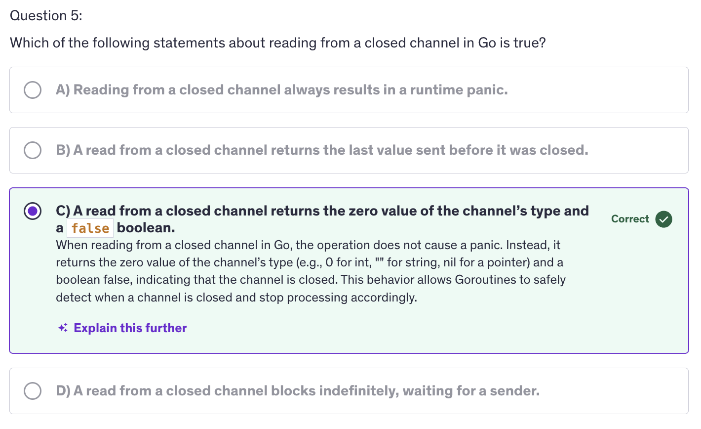
<br/>


## Context


## TImers


## Tickers


## Worker Pools


## Wait Groups


## Advanced: Quiz-3


## Mutexex


## Atomic Counters


## Rate Limiting


## Rate Limiting - Token Bucket Algorithms


## Rate Limiting - Fixed Window Counter


## Rate Limiting - Leaky Bucket Algorithm


## Stateful Goroutines


## Sorting


## Advanced: Quiz-4


## Testing / Benchmarking


## Executing Processes / OS Processes / Other Processes


## Signals


## Reflect


## Advanced: Quiz-6


