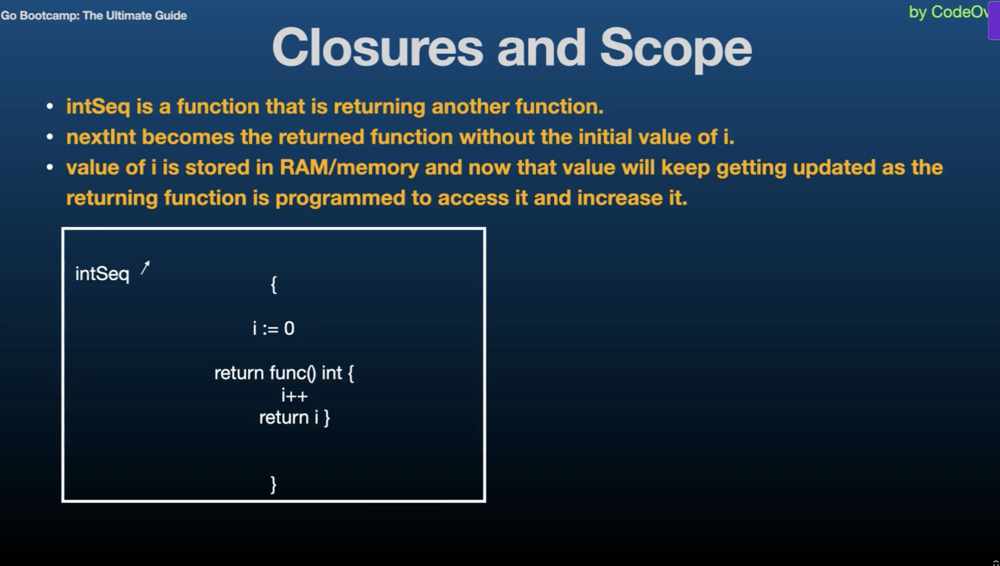

# Go Programming: Intermediate

## Closures

- A closure is a function value that references variables from outside it's body. The function may access and assign to the captured variables, and these variables persist as long as closure itself is referenced.

- Closures work with lexical scoping, meaning they capture variables from their surrounding context where they are defined. This allows closure to access variables even after the outer function has finished execution.

- Closures leverage the first class objects property of functions by allowing functions to capture and manipulate their surrounding state.

- Code Summary : 
    - i and the gofer assignment zero line and the fmt.Println("Previous values of i:") run everytime you call the adder function, but they only affect the initial state of i. When you create a new closure by calling sequence but they only affect the initial state of i when you create a new closure by calling adder function.

    - Once the closure is created, the subsequent calls to the closure that is, the returned function use and modify the captured value of i.

- Practical Use Cases
    - Stateful functions
    - Encapsulation
    - Callbacks

- Usefulness of Closures
    - Encapsulation
    - Flexibility
    - Readability

- Considerations
    - Memory Usage
    - Concurrency

- Best Practices
    - Limit Scope
    - Avoid Overuse

- Closures are useful for creating functions that maintain state accross multiple calls without exposing the state directly.

- They help encapsulate functionality and data, allowing for cleaner and more modular code.

- Closures are commonly used in callback functions, where they capture cariables to provide context or maintain state during asynchronous operations.

- Closures can keep variables alive longer than expected if they hold references to large objects or resources.

- Care must be taken when using closures in concurrent programs to avoid race conditions and unintended side effects. That's why it's better to limit the scope. Keep the scope of captured variables enclosures as narrow as possible to minimize unintended side effects.

## Recursion

## Pointers

## String and Runes

## Formatting Verbs

## `fmt` Package

## Structs

## Methods

## Interfaces

## Struct Embedding

## Generics

## Intermediate Quiz 1

## Errors

## Custom Errors

## String Functions

## String Formatting

## Text Templates

## Regular Expressions

## Time

## Epoch

## Time Formatting / Parsing

## Random Numbers

## Number Parsing

## Intermediate Quiz 2

## URL Parsing

## `bufio` package

## Base64 Coding

## SHA256 / 512 Hashes / Hashing / Cryptography

## Writing Files

## Reading Files

## Line Filters

## File Paths

## Directories

## Temporary Files and Directories

## Embed Directive

## Intermediate Quiz 3

## Command Line Arguments / Flags

## Command Line Sub Commands

## Environment Variables

## Logging

## JSON

## Struct Tags

## XML

## Go Extension

## Type Conversions

## IO Package

## Math Package

## Intermediate Quiz 4