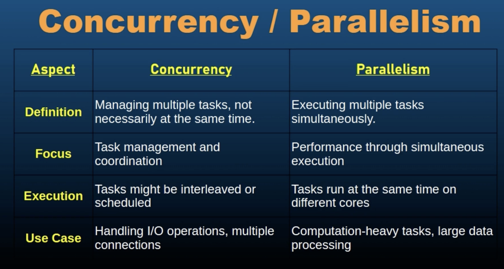

# Go Programming: More about Concurrency

## Concurrency vs Parallelism

- Concurrency: The ability of a system to handle multple tasks simultaneously. It involves managing multiple tasks that are in progress at the same time but not necessariliy executed at the same instant.

- Parallelism: The simultaneous execution of multiple tasks, typically using multiple processors or cores, to improve performance by running operations at the same time.

- 

- Parallelism is all about executing multiple  tasks simultaneously, typically on multiple cores or processors and this is a subset of concurrency. 

    How parallelism is implemented in GO ?
    - It's the go runtime. Go's runtimes scheduler can execute Go routines in parallel, taking advantage of multiple core processors.

    

- We can have processes that are executed concurrently without being parallel. And that happens when we have a single core CPU with time slicing. The single core CPU will divide time using time slicing and work on those multiple tasks simultaneously by dividing time and giving time to different functions, different tasks in a shared way. eg: So maybe 200 milliseconds to a tasks and then next 200 ms to another tasks and next 50 ms to the first task that it left earlier, and so on.

- Practical Applications:
    - Concurrency Use cases:
        - I/O bound tasks
        - Server Applications
    - Parallelism Use Cases
        - CPU Bound tasks
        - Scientific Computing

- Challenges and Considerations :
    - Concurrency Challenges
        - Synchronization: managing shared resources to prevent race conditions.
        - Deadlocks: avoid situations where tasks are stuck waiting for each other.
    - Parallelism Challenges
        - Data Sharing
        - Overhead
    - Performance Tuning

## Race Conditions

## Deadlocks

## RWMutex

## `sync.Once`

## `sync.Pool`

## `for select` statement

## Advanced Concurrency Quiz